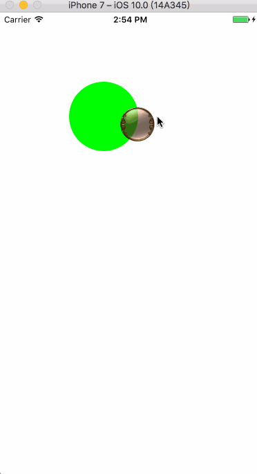

# QMJoyStick
iOS摇杆（UIView实现）

演示
==============

使用方法
==============
//位置自己定义
`QMJoyStick *joystick = [[QMJoyStick alloc]initWithFrame:CGRectMake(100, 100, 100, 100)];`

`[self.view addSubview:joystick];`
    
系统要求
==============
基于UIView，无要求

安装
==============

### 手动安装

1. 下载 QMJoyStick 文件夹内的所有内容。
2. 将 QMJoyStick 内的源文件添加(拖放)到你的工程。
3. 导入 `QMJoyStick.h`。

许可证
==============
QMJoyStick 使用 MIT 许可证，详情见 LICENSE 文件。